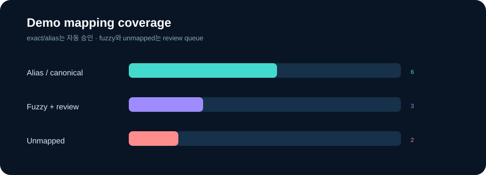

<h1 align="center">🗺️ Med Endpoint Mapper</h1>

<p align="center">
  <b>제각각인 biomedical endpoint를 추적 가능한 표준 개념으로.</b><br/>
  alias · typo · domain context · confidence · human review를 하나의 라이브러리로 관리합니다.
</p>

<p align="center">
 
 
 
 
</p>

<p align="center"></p>

## 해결하는 문제

`EE%`, `encapsulation rate`, `봉입 효율`처럼 같은 endpoint가 다르게 쓰이고,
`response rate`처럼 domain 없이는 뜻이 모호한 표현도 있습니다. 단순 문자열 치환은
오매핑을 숨깁니다. 이 라이브러리는 **매칭 근거와 검토 필요 여부를 결과에 포함**합니다.

```python
from endpoint_mapper import EndpointMapper

mapper = EndpointMapper.from_json("config/endpoints.json")
result = mapper.map("transfection efficency", domain="drug_delivery")

print(result.endpoint_id)   # EP-LNP-003
print(result.match_method)  # fuzzy
print(result.needs_review)  # True
```

## CLI

```bash
pip install -e .
endpoint-map --input data/demo_endpoints.csv
python -m unittest discover -s tests -v
```

<p align="center"></p>

## 로컬 JSON API

```bash
endpoint-serve --port 8080
curl http://127.0.0.1:8080/health
curl -X POST http://127.0.0.1:8080/map \
  -H "Content-Type: application/json" \
  -d '{"endpoint":"median PFS","domain":"oncology"}'
```

## 의도적으로 보수적인 설계

| 입력 상태 | method | 처리 |
|---|---|---|
| canonical name | `canonical` | 자동 승인 후보 |
| 등록 alias | `alias` | 자동 승인 후보 |
| typo / 변형 | `fuzzy` | `needs_review=True` |
| threshold 미달 | `unmapped` | 강제 매핑하지 않음 |

## 구조

```text
med-endpoint-mapper/
├─ config/endpoints.json
├─ data/demo_endpoints.csv
├─ docs/ONTOLOGY_GUIDE.md
├─ src/endpoint_mapper/
│  ├─ mapper.py
│  ├─ cli.py
│  └─ server.py
├─ tests/
└─ assets/
```

## 주의

`EP-*`는 이 데모의 자체 namespace입니다. 공식 SNOMED CT·LOINC·CDISC 코드로 가장하지
않습니다. 의료 의사결정용이 아니며, production ontology에는 버전·라이선스·reviewer
정보가 추가되어야 합니다.
