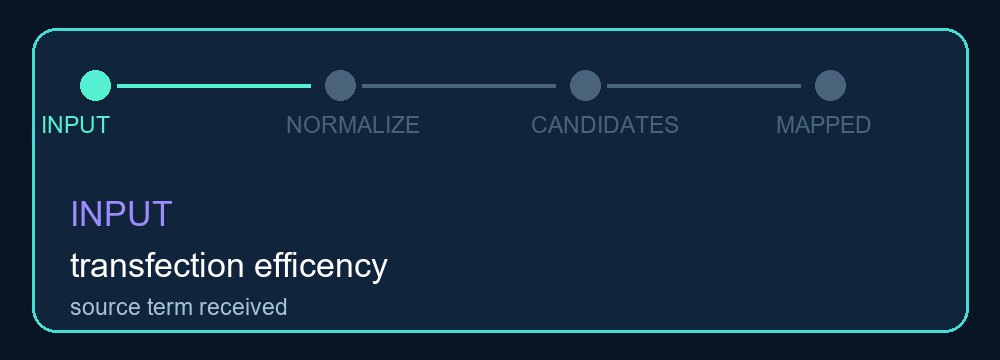

# Med Endpoint Mapper

**Auditable normalization of heterogeneous biomedical endpoints into reviewable concepts.**


> [!IMPORTANT]
> **Public demonstration notice.** This repository is a deliberately reduced and sanitized reference implementation of a broader internal terminology-normalization workflow. Proprietary vocabularies, partner-specific mappings, reviewer records, production services, confidential datasets, and selected operational code have been removed, generalized, masked, or replaced with synthetic examples. The public version demonstrates conservative matching and audit patterns; it is not a complete ontology, terminology service, or medical decision system.

## Executive summary

Biomedical datasets frequently express the same endpoint in incompatible ways: `EE%`, `encapsulation rate`, and `encapsulation efficiency` may describe one concept, while a phrase such as `response rate` can remain ambiguous without a therapeutic domain. A simple search-and-replace table hides uncertainty and makes mapping errors difficult to review.

Med Endpoint Mapper resolves canonical terms and registered aliases exactly, uses domain-restricted fuzzy comparison for likely spelling variants, and returns an explicit review decision with every result. Weak matches are not forced into the nearest concept. The library, batch CLI, and local JSON API all expose the same structured result contract.

## The decision model

Every source term follows one of four paths:

| Input condition | Method | Confidence | Default handling |
|---|---|---:|---|
| Canonical name | `canonical` | 1.00 | Candidate for automatic acceptance |
| Registered alias | `alias` | 0.98 | Candidate for automatic acceptance |
| Similar spelling above threshold | `fuzzy` | Calculated | Always requires review |
| No candidate above threshold | `unmapped` | 0.00 | Retain for curation |

This conservative behavior is intentional. A false mapping can contaminate downstream aggregation, unit conversion, and evidence synthesis; an unmapped term is visible and recoverable.

## What the public implementation includes

- Unicode NFKC and punctuation-aware normalization;
- exact canonical and alias indexing;
- optional domain filtering;
- combined character-similarity and token-overlap scoring;
- configurable fuzzy threshold;
- immutable structured mapping results;
- CSV batch processing with method counts;
- local health and mapping endpoints using the Python standard library;
- a small demo namespace spanning drug delivery, oncology, and metabolism.

## Architecture



```text
source endpoint + optional domain
              |
              v
Unicode and punctuation normalization
              |
      +-------+--------+
      |                |
      v                v
exact index      domain-filtered candidates
      |                |
canonical/alias   character + token similarity
                       |
             +---------+---------+
             |                   |
             v                   v
       fuzzy review           unmapped
              |
              v
structured MappingResult -> CSV, library caller, or JSON API
```

## Normalization and matching mechanics

Input text is normalized with Unicode NFKC, lowercased, trimmed, and converted from punctuation-separated forms into stable whitespace. Canonical names and aliases share one lookup index.

If exact resolution fails, the mapper compares the query only with concepts in the requested domain. Its fuzzy score combines character-sequence similarity and token Jaccard overlap:

```text
score = 0.78 x sequence similarity + 0.22 x token overlap
```

The default threshold is 0.72. Threshold selection is application-specific and must be calibrated against a labeled validation set before production use.

## Mapping result contract

Every call returns the same fields:

| Field | Meaning |
|---|---|
| `source` | Original endpoint string |
| `endpoint_id` | Demo concept identifier, or null |
| `canonical_name` | Normalized concept name |
| `label_ko` | Optional Korean display label from the demo registry |
| `canonical_unit` | Expected unit recorded by the concept |
| `domain` | Drug delivery, oncology, or metabolic context |
| `match_method` | Canonical, alias, fuzzy, or unmapped |
| `confidence` | Exact confidence or calculated similarity |
| `matched_term` | Canonical term or alias that matched |
| `needs_review` | Explicit review-queue decision |

`needs_review` is true for every fuzzy match, every unmapped term, and any result below the automatic confidence boundary. Confidence is evidence for workflow routing, not a calibrated probability of semantic correctness.

## Demo namespace

The registry in `config/endpoints.json` contains a small set of example concepts:

- drug delivery: encapsulation efficiency, hydrodynamic diameter, transfection efficiency;
- oncology: objective response rate and progression-free survival;
- metabolic research: body-weight change and glycated hemoglobin.

The `EP-*` identifiers are local demonstration IDs. They are not official SNOMED CT, LOINC, CDISC, or regulatory terminology codes.

## Quick start

### Python library

```bash
python -m venv .venv
python -m pip install -e .
```

```python
from endpoint_mapper import EndpointMapper

mapper = EndpointMapper.from_json('config/endpoints.json')
result = mapper.map('transfection efficency', domain='drug_delivery')

print(result.endpoint_id)
print(result.match_method)
print(result.confidence)
print(result.needs_review)
```

The misspelled example uses fuzzy matching and enters the review queue.

### Batch CLI

```bash
endpoint-map --input data/demo_endpoints.csv --ontology config/endpoints.json --output output/mapped_endpoints.csv --threshold 0.72
python -m unittest discover -s tests -v
```

The CLI preserves source columns, appends mapping-result fields, writes CSV, and prints counts by method.

### Local JSON API

```bash
endpoint-serve --ontology config/endpoints.json --port 8080
curl http://127.0.0.1:8080/health
```

```text
POST http://127.0.0.1:8080/map
Content-Type: application/json
Body fields: endpoint, optional domain
```

The server binds to localhost and provides `GET /health` and `POST /map`. Authentication, TLS, rate limiting, concurrency controls, observability, and production hardening are outside this demonstration.

## Extending the registry safely

1. Assign a stable local identifier and canonical name.
2. Record the domain and canonical unit.
3. Add only aliases verified to have the same meaning in that domain.
4. Add exact, fuzzy, ambiguous, and negative test cases.
5. Review changes with a domain expert and record the reason.
6. For external terminologies, record system, version, mapping relation, and license.

Do not treat similarity as ontology alignment. Production mapping to SNOMED CT, LOINC, CDISC, or another governed system requires versioned crosswalks and appropriate licensing.

## Repository layout

```text
med-endpoint-mapper/
|-- config/endpoints.json       # Demo concepts and aliases
|-- data/demo_endpoints.csv     # Synthetic source terms
|-- docs/ONTOLOGY_GUIDE.md      # Governance principles
|-- src/endpoint_mapper/
|   |-- mapper.py               # Normalization and matching
|   |-- cli.py                  # Batch CSV interface
|   `-- server.py               # Local JSON API
|-- output/                     # Demonstration mappings
|-- assets/                     # Animation and coverage chart
`-- tests/test_mapper.py        # Normalization and mapping behavior tests
```

## Validation and production-readiness checklist

```bash
python -m unittest discover -s tests -v
```

For a governed deployment, add:

- a labeled validation set and precision and recall by domain;
- inter-reviewer agreement and adjudication rules;
- alias-collision and identifier-stability checks;
- registry versioning and immutable decision logs;
- rollback procedures and source provenance;
- monitored queues with review turnaround targets;
- authenticated, observable, production-grade service infrastructure.

## Scope and limitations

- The bundled registry and input rows are demonstrations, not a terminology release.
- Fuzzy confidence is string similarity, not a semantic probability.
- Exact aliases can still be wrong if a registry entry is curated incorrectly.
- Domain labels reduce ambiguity but do not model full experimental context.
- Canonical units are metadata; this project does not convert measurement values.
- The local server is for demonstration and trusted-machine use only.
- Outputs must not drive clinical, regulatory, or patient-care decisions.

## License

Code is available under the [MIT License](LICENSE). External terminologies and mappings may require separate licenses and attribution.
